# Tintenklecks

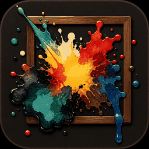

Deutsch · [English](README.en.md)

Firmware für den **Waveshare ESP32-S3 PhotoPainter** (7,3″ Spectra-6 / E6, 480×800).
Der Rahmen ist dafür da, **besondere Tage nicht zu vergessen**: Geburtstage, Sterbetage und andere Jahrestage (Hochzeit, Kennenlernen …). Zwei Töpfe: **Zufall** und **Erinnerungen**. Erinnerungen kommen von selbst, sobald der Tag **heute, morgen oder übermorgen** ist — ein Bild voll, bei mehreren Hinweis unten rechts. Zuschnitt, Verfahren und Beschriftung laufen im Browser auf dem Rahmen. Die Galerie liegt auf der SD-Karte. Kein ESP-IDF, nur Arduino IDE.

© 2026 Ingo Lissors · Herkunft und Lizenzen: [CREDITS.txt](CREDITS.txt) · [LICENSE](LICENSE)

Gemeinfreies Demo: [`examples/mona_lisa.bmp`](examples/mona_lisa.bmp) (Leonardo da Vinci, *Mona Lisa*).
Weiteres Demo: [`examples/peter.bmp`](examples/peter.bmp) (Person, Beschriftung, Fett) — siehe [`examples/peter.SOURCE.md`](examples/peter.SOURCE.md).

Sketch-Datei: `Bilderrahmen.ino` (Ordnername bleibt, sonst findet die Arduino IDE den Sketch nicht).

## Erinnerungen — Geburt, Tod, Besonderes, Texte

Im Studio unter **Bildart** **Normal** oder **Erinnerung**. Normal bleibt im Zufallstopf. Erinnerung fliegt raus aus dem Zufall — unabhängig davon, ob schon ein Datum steht. Mit **Geburtsdatum**, **Sterbedatum** oder **Besonderes Datum** (`TT.MM.JJJJ`) hängt sie am Jahrestag: der Timer zeigt sie **am Tag selbst, morgen oder übermorgen**, jeweils **ein** Bild voll. Sind mehrere fällig: eines zufällig, unten rechts z. B. **2 weitere Erinnerungen**, **KEY** und alle **3 Stunden** das nächste. Beim besonderen Datum gehört ein **Anlass** dazu (z. B. Hochzeitstag, Kennenlerntag). Dafür muss die Chip-Uhr stimmen und unter Rahmen ein Wechsel (**Im Intervall** oder **1× pro Tag**) an sein.

**KEY** und **Jetzt wechseln** nehmen sonst nur Zufall. Nur wenn mehrere Erinnerungen fällig sind, blättert KEY durch die noch nicht gezeigten; sind alle durch, wieder Zufall. Alte JSON ohne Feld `kind`: Datum da = Erinnerung, sonst Zufall.

Auf dem Bild selbst: Name, `*` Geburt, `†` Tod, Anlass plus Datum, plus freie Hinweise (z. B. „In Erinnerung“). Die **Bildbeschreibung** steht nur in der Live-Anzeige, nicht auf dem Panel.

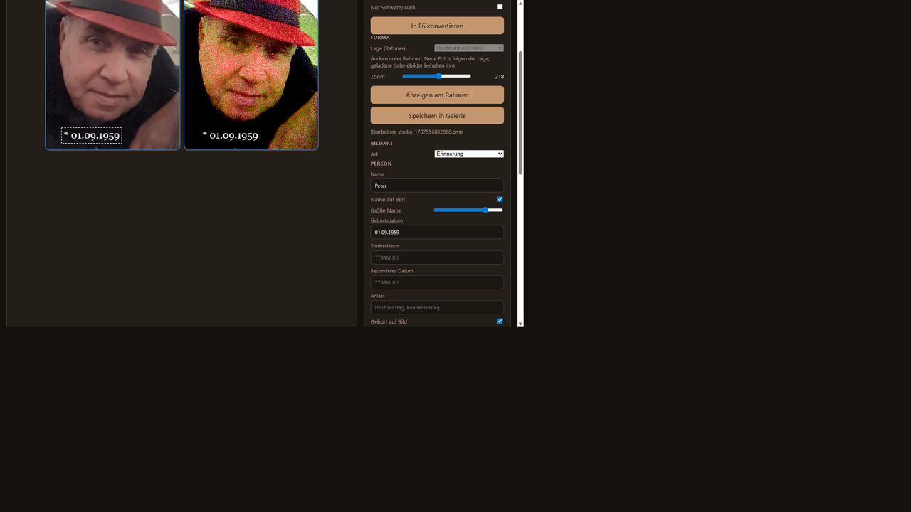

Name, Daten, Häkchen **Name auf Bild** / **Geburt auf Bild** / **Tod auf Bild** / **Besonderes auf Bild**. Die Daten steuern *wann* die Erinnerung kommt, nicht ob sie Zufall ist. Ob der Text auf dem Panel steht, ändert das nicht.

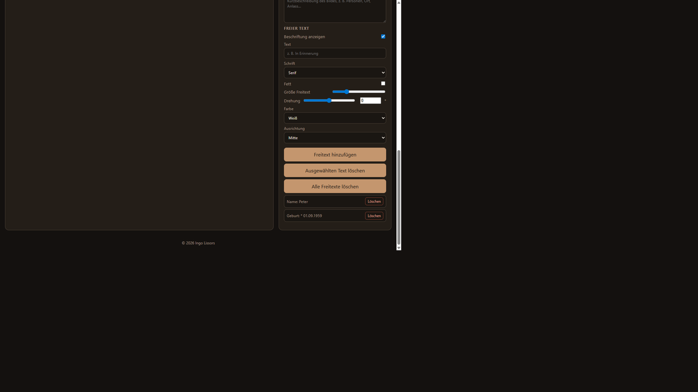

Freitexte, Schrift, **Fett**, Drehung, Farbe. In der Liste stehen Name, Geburt, Tod, Besonderes und Hinweise.

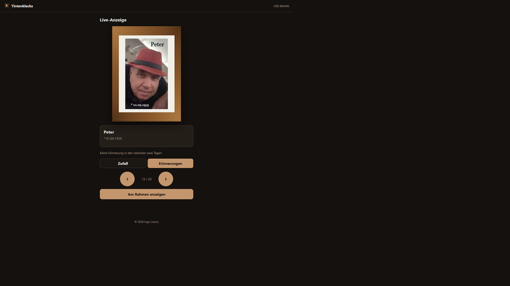

Live-Anzeige: Bild mit Text, darunter Name, Daten, Beschreibung und Freitexte.

## Hardware

- Waveshare ESP32-S3 PhotoPainter, Spectra-6 / E6
- **Lautsprecher am Rahmen** (ES8311 + PA, sitzt auf der Platine — ohne ihn kein Ton)
- Micro-SD, **FAT32**
- USB-C am Rahmen (Flashen und Web)
- optional Akku (AXP2101)

## SD-Karte einrichten

Ohne Karte startet das Web, Bilder und Ton fehlen.

1. Karte am PC als **FAT32** formatieren (eine Partition).
2. Zwei Ordner anlegen und die mitgelieferten WAV-Dateien kopieren:

```
sound/willkommen.wav
sound/wlan.wav
sound/ap.wav
sound/neustart.wav
pic/
```

Die vier WAV-Dateien liegen im Ordner `sound/` dieses Downloads. Nach `sound/` auf der Karte kopieren, Namen nicht ändern.

`pic/` bleibt leer, außer du kopierst die Demos. Bilder entstehen sonst erst im Studio. In [`examples/`](examples/) liegen fertige Galerie-Sets — jeweils BMP, JSON, `_src.jpg` und `_thumb.jpg` nach `pic/` kopieren:

- `mona_lisa.*` — Leonardos *Mona Lisa* (gemeinfrei, Wikimedia). [`SOURCE`](examples/mona_lisa.SOURCE.md)
- `peter.*` — Beispiel mit Name, Daten und fetter Schnörkelschrift. [`SOURCE`](examples/peter.SOURCE.md)

3. Karte in den Rahmen, **dann** Firmware flashen.

| Datei | Wann |
| --- | --- |
| `willkommen.wav` | jeder Reset/Reboot (nicht nach Deep Sleep) |
| `wlan.wav` | Heimnetz verbunden |
| `ap.wav` | kein WLAN, Access Point |
| `neustart.wav` | kurz vor Software-Neustart |

PCM-WAV, 16 Bit, Mono oder Stereo. Fehlt eine Datei, bleibt dieser Clip stumm.

## Fertige Firmware (ohne Arduino)

Für den Rahmen reicht: **USB-C**, die Datei `tintenklecks-merged.bin` von [Releases](https://github.com/Lissors/tintenklecks/releases), danach die SD wie oben.

1. SD einlegen (Tonordner, leeres `pic/` oder Demos).
2. [Neueste Release](https://github.com/Lissors/tintenklecks/releases/latest) → `tintenklecks-merged.bin` laden.
3. Chrome oder Edge: [Adafruit WebSerial ESPTool](https://adafruit.github.io/Adafruit_WebSerial_ESPTool/). USB-C am Rahmen, **Connect**, Datei wählen, Offset **0x0**, **Program**. Wenn kein Port: BOOT halten, USB einstecken, loslassen.
4. Access Point **Tintenklecks** / Passwort `tintenklecks` → [http://192.168.4.1](http://192.168.4.1) fürs Heimnetz.

Keine Arduino IDE. Bilder kommen im Studio auf die Karte.

Die `.bin` erzeugt der Maintainer in der Arduino IDE (unten). Ohne Release-Datei diesen Abschnitt überspringen und per Arduino hochladen.

## Arduino IDE

1. [Arduino IDE 2](https://www.arduino.cc/en/software) installieren.
2. Datei → Einstellungen → Zusätzliche Boardverwalter-URLs:

```
https://espressif.github.io/arduino-esp32/package_esp32_index.json
```

3. Werkzeuge → Board → Boardverwalter: **esp32** von Espressif Systems installieren.
4. Sketch → Bibliothek einbinden → Bibliotheken verwalten: **XPowersLib** (Lewis He) installieren.
5. Ordner `Bilderrahmen` öffnen (Datei `Bilderrahmen.ino`).
6. Werkzeuge wie unten setzen, Port wählen, Hochladen.

### Werkzeuge (ESP32S3 Dev Module)

Diese Werte müssen stimmen. Falsches PSRAM oder zu kleine App-Partition: Bootschleife oder der Sketch passt nicht.

| Menü | Einstellung |
| --- | --- |
| Board | **ESP32S3 Dev Module** |
| USB CDC On Boot | **Enabled** |
| USB Mode | **Hardware CDC and JTAG** |
| USB DFU On Boot | Disabled |
| CPU Frequency | 240 MHz (WiFi/BT) |
| Flash Mode | QIO 80 MHz |
| Flash Size | **16MB (128Mb)** |
| Partition Scheme | **16M Flash (3MB APP/9.9MB FATFS)** |
| PSRAM | **OPI PSRAM** |
| Upload Mode | UART0 / Hardware CDC |
| Upload Speed | 921600 |
| Arduino Runs On | Core 1 |
| Events Run On | Core 1 |
| Erase All Flash Before Sketch Upload | Disabled |

Fehlt der Eintrag „16M Flash (3MB APP/9.9MB FATFS)“, nimm **Huge APP (3MB No OTA/1MB SPIFFS)**. Dann gibt es **kein OTA**. Die Daten liegen auf der SD, nicht im Flash-Dateisystem. Nach Wechsel des Partitionsschemas können WLAN-Daten weg sein — dann einmal WLAN-Setup.

USB-C am Rahmen wählen (nativer USB des ESP32-S3). BOOT-Taste nur, wenn der Upload den Chip nicht selbst startet.

**Später ohne USB (nur wer Arduino hat):** einmal mit diesem Sketch per USB hochladen. Rahmen im Heimnetz und **wach** (USB eingesteckt, oder nicht im Deep Sleep). In der Arduino IDE unter **Port** den Eintrag **tintenklecks** (Netzwerk) wählen, dann Hochladen wie sonst. Deep Sleep: kein Netzwerk-Port — BOOT oder USB, dann erneut versuchen.

**`.bin` für andere (Releases):** Werkzeuge wie oben, dann Sketch → **Kompilierte Binärdatei exportieren**. Im Sketch-Ordner (oder unter `build/`) die Datei **`Bilderrahmen.ino.merged.bin`** suchen — das ist Bootloader + Partitionen + App in einem. Umbenennen nach `tintenklecks-merged.bin` und unter GitHub → Releases anhängen. Nicht die kleine `.ino.bin` allein (ohne Bootloader bootet ein leerer Chip nicht).

Der Serial Monitor ist optional. Schließen der Arduino IDE startet den Chip oft neu (USB CDC / DTR) — das ist normal.

## Erstes WLAN

Ohne gespeichertes Netz: Access Point **Tintenklecks**, Passwort `tintenklecks`.

Im Browser: [http://192.168.4.1](http://192.168.4.1) — Heimnetz eintragen oder nur AP-Passwort setzen, Speichern & neu starten.

Mit WLAN: IP aus dem Router oder später [http://tintenklecks.local](http://tintenklecks.local).

## Bedienung

Im Browser die IP des Rahmens öffnen: Access Point [http://192.168.4.1](http://192.168.4.1), im Heimnetz die IP aus dem Router oder später [http://tintenklecks.local](http://tintenklecks.local). Lange Vorgänge (Anzeigen, Speichern, Wechsel) zeigen **Bitte warten…** — in der Zeit sind die Knöpfe gesperrt. Taster sind hellbraun; beim Drücken kurz dunkler. **Zufall** / **Erinnerungen** in Galerie und Live sind Umschalter. **Löschen** bleibt rot.

### Kopfzeile (alle Seiten)

Oben links das **Icon** und **Tintenklecks**: auf Unterseiten ein Link zurück ins Hauptmenü, auf dem Menü nur der Name. Im Browser-Tab dasselbe Icon.

Rechts **Akku … %**, bei Ladung **· lädt**, oder **USB-Betrieb**. Daneben **zzz** — nur ohne USB sichtbar. Der Knopf schickt den Rahmen sofort in den Deep Sleep. Ein offener Tab (Status alle 15 s) hält den Rahmen wach.

### Tasten am Gerät

| Taste | Wach | Aus dem Deep Sleep |
| --- | --- | --- |
| **KEY** | nächstes Bild (Zufall; bei mehreren fälligen Erinnerungen die nächste) | wecken, wechseln, wieder schlafen |
| **BOOT** | — | Web an, **kein** Bildwechsel |

### USB und Akku

USB: der Rahmen bleibt wach.

Akku und Wechsel **≥ 10 Minuten** oder **1× pro Tag**: ohne offenes Web direkt nach dem Bildwechsel Deep Sleep, mit Browser nach 60 Sekunden Pause. **5 Minuten**-Intervall: bleibt wach. Wecken: nächster Timer, KEY oder BOOT.

### Hauptmenü

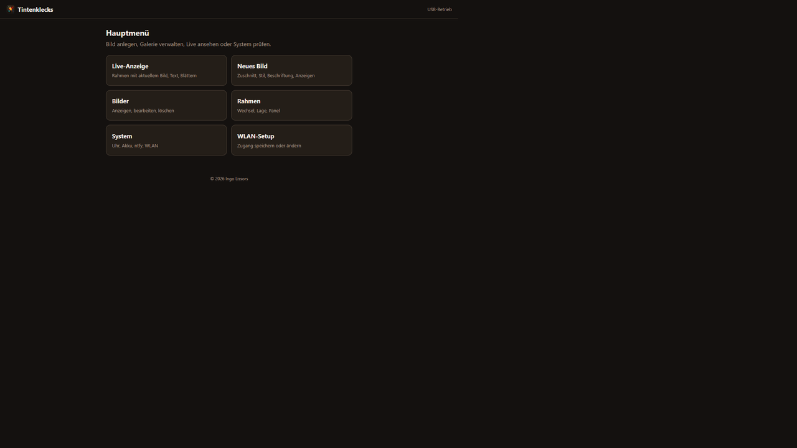

Sechs Kacheln:

| Kachel | Seite |
| --- | --- |
| Live-Anzeige | aktuelles Bild im Holzrahmen, Text, blättern (Zufall / Erinnerungen) |
| Neues Bild | Studio: Foto, Zuschnitt, Verfahren, Beschriftung |
| Bilder | Galerie: Zufall und Erinnerungen, anzeigen, bearbeiten, umbenennen, löschen |
| Rahmen | Wechsel, Lage, Panel, Topf; Timer nimmt Erinnerungen zuerst |
| System | Uhr, Status, ntfy, Ton, Sicherung, Neustart, WLAN vergessen |
| WLAN-Setup | Heimnetz und AP-Passwort |

### Neues Bild (Studio)

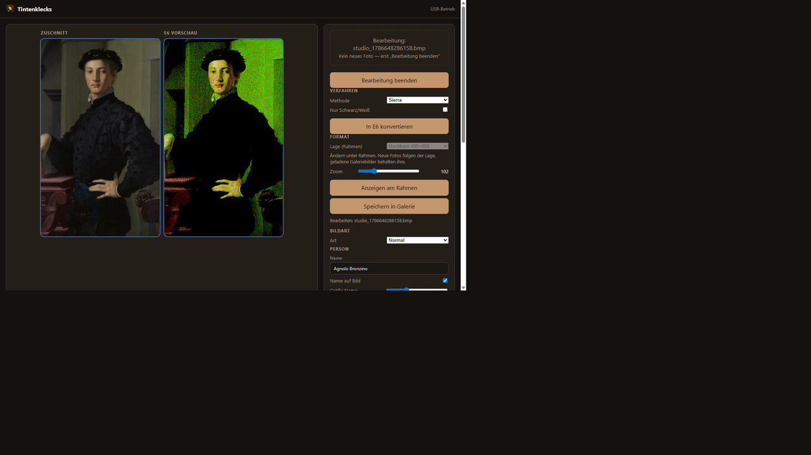

Zwei Bühnen: links **Zuschnitt**, rechts **E6 Vorschau**. Das Foto in das gestrichelte Feld ziehen oder tippen (JPG, PNG, BMP). Mausrad zoomt, Ziehen auf der linken Bühne verschiebt den Ausschnitt — das Bild folgt der Maus (auch senkrecht).

Beim **Bearbeiten** aus der Galerie steht **Bearbeitung beenden**. Solange die Bearbeitung läuft, nimmt das Drop-Feld kein neues Foto. Die **E6 Vorschau** zeigt das gespeicherte Bild unverändert, inklusive Text. Lab-Schieber und Freitexte stehen wie zuletzt gespeichert. Neu gerechnet wird erst, wenn Zuschnitt oder Lab-Werte sich ändern.

#### Verfahren

**Methode Sierra** (Vorgabe bei neuen Bildern): Zoom und Ausschnitt zuerst, dann **In E6 konvertieren**. Ohne diesen Schritt weder Anzeigen noch Speichern. Schieber Vorbereitung/Dither und **Automatik** sind hier unsichtbar.

**Methode Lab**: Schieber unter **Vorbereitung** und **E-Paper / Dither**. **Automatik** sucht Werte zum aktuellen Zuschnitt. Alte Galeriebilder ohne gespeicherte Methode öffnen als Lab und behalten ihre Schieber.

Vorbereitung (nur Lab): Belichtung, Sättigung, S-Kurve, Lichter stauchen, Schatten, Mitte, Häkchen **Tonumfang ins Papier**.

E-Paper / Dither (nur Lab): Helligkeit, Kontrast, Wärme, Dither %, Algorithmus Atkinson / Floyd–Steinberg / Stucki / Ohne.

#### Format und Ausgabe

**Lage (Rahmen):** Hochkant 480×800 oder Quer 800×480 — steht unter Rahmen → Anzeige (**Rahmenlage**), im Studio nur Anzeige. Neue Fotos folgen der Lage, geladene Galeriebilder behalten ihre. Vorhandene BMP werden nicht umgerechnet. **Zoom** 10–400.

**Anzeigen am Rahmen** schreibt nur aufs Panel, nicht in die Galerie. **Speichern in Galerie** legt BMP, Zuschnitt und Vorschaubild auf der SD ab. Ändert man an einem gespeicherten Bild nur Text oder Person, speichert der Rahmen die Metadaten, ohne neu zu dithern.

#### Bildart und Person


**Art:** **Normal** (Zufallstopf) oder **Erinnerung** (raus aus dem Zufall). Datumsfelder nur bei Erinnerung: Geburtsdatum, Sterbedatum, Besonderes Datum (`TT.MM.JJJJ`) und Anlass (Hochzeitstag, Kennenlerntag …). Häkchen **Name auf Bild**, **Geburt auf Bild**, **Tod auf Bild**, **Besonderes auf Bild** und Schieber **Größe Name** / **Größe Daten**. Name und Daten lassen sich auf dem Zuschnitt verschieben.

Ohne passenden Jahrestag (heute/morgen/übermorgen) bleibt eine Erinnerung weg — der Timer greift dann auf Zufall zurück. KEY und **Jetzt wechseln** tun das auch, außer mehrere Erinnerungen sind gerade fällig: dann die noch nicht gezeigten, danach wieder Zufall.

#### Bildbeschreibung

Freitext nur für die Live-Anzeige, nicht auf dem Panel. Dort steht er unter dem Holzrahmen, zusammen mit Name und Daten.

#### Freier Text


Häkchen **Beschriftung anzeigen** (aus: Name, Daten und Freitexte unsichtbar). Felder: Text, Schrift Serif / Sans / Schnörkel, Fett, Größe, Drehung (−180° bis 180°), Farbe Weiß / Schwarz / Gelb / Rot / Blau / Grün, Ausrichtung Mitte / Links / Rechts.

**Freitext hinzufügen**, in der Liste auswählen, auf dem Zuschnitt verschieben. **Ausgewählten Text löschen** oder **Alle Freitexte löschen**. **Fett** gilt für den ausgewählten Text (Name, Daten oder Freitext), auch bei Schrift Schnörkel. Typisch: „In Erinnerung“.

### Bilder (Galerie)

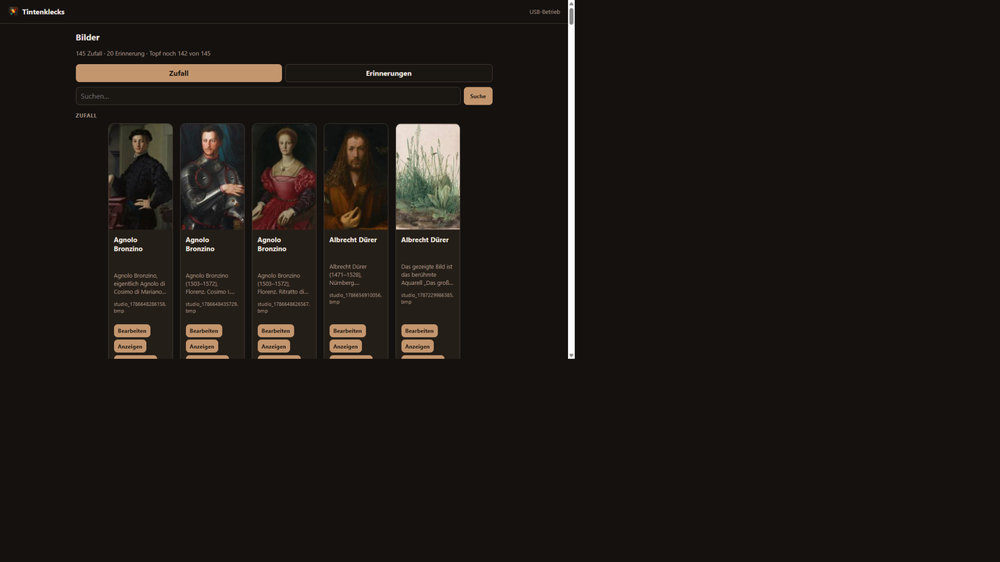

Zwei Reiter: **Zufall** und **Erinnerungen**. Darunter **Suchen** (Name, Datum, Dateiname) — erst mit **Enter** oder Knopf **Suche**, alles andere wird ausgeblendet. Das **X** im Feld leert die Suche und zeigt wieder alle Bilder. Oben die Zähler und der **Zufallstopf** (noch *n* von *m*; ist der Topf leer: nächster Zug neue Runde). Karten nach Personenname. Vorschau mit Beschriftung wie im Studio, darunter Name, `*` Geburt, `†` Tod, Anlass plus besonderes Datum, Beschreibung (Tipp klappt den ganzen Text auf), Dateiname.

| Knopf | Wirkung |
| --- | --- |
| Bearbeiten | Studio: gespeichertes E6-Bild, Lab-Werte und Text |
| Anzeigen | dieses BMP aufs Panel |
| Umbenennen | Dateiname ohne `.bmp` |
| Löschen | BMP plus JSON, Vorschauen und zugehörigen Ton (Nachfrage). Hängt genau dieses Bild am Panel, kommt danach das nächste — wie KEY / Jetzt wechseln |

Fehlt die Vorschau: **Kein Vorschaubild · neu speichern**. Ohne Zuschnitt-Datei ein roter Rand und **Kein Zuschnitt**. Der Index liegt als Datei auf der SD und wird beim Speichern, Löschen oder Umbenennen sofort mitgeführt — Zufall und Erinnerungen ohne Vollscan. Nur wenn die Datei fehlt (oder nach Wiederherstellen), wird sie neu gebaut; dann wartet die Seite (**Galerie-Index wird gebaut…**). Reste ohne Bild (JPG/JSON ohne BMP) gehen mit, wenn der Index neu aufgebaut wird. Fehlende Vorschaubilder versucht die Seite selbst nachzuziehen.

### Live-Anzeige

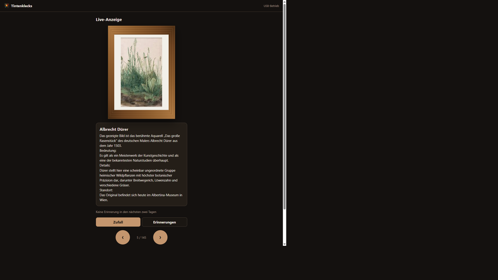

Holzrahmen-Vorschau des gewählten Bildes samt Text auf dem Bild (Vorschaubild / Thumb, Zuschnitt schon drin). Darunter Name, Daten, Bildbeschreibung, Freitexte, dann eine Zeile **Nächste Erinnerung** (nicht im Holzrahmen). Kein Dateiname — der steht in der Galerie. Reiter **Zufall** / **Erinnerungen**, **‹** / **›** blättern, Zähler in der Mitte. Erinnerungen stehen wie in der Galerie nach Namen. Die Attrappe folgt der Lage des Bildes (Hochkant oder Quer).


**Am Rahmen anzeigen** schickt genau dieses Bild aufs Panel. Hängt es schon, steht der Knopf **Am Rahmen (aktuell)** und ist gesperrt.

Leere Liste: **Kein Bild**.

### Rahmen

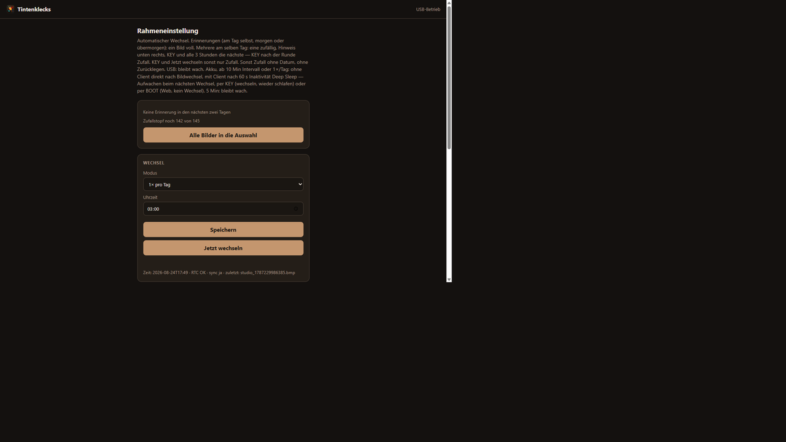

**Nächste Erinnerung** (heute, morgen oder übermorgen: Datum · Name) und **Zufallstopf noch n von m**. **Alle Bilder in die Auswahl** mischt den Zufallstopf neu (alle Zufallsbilder wieder drin). **Index neu aufbauen** scannt die SD und sortiert nach Namen — Speichern, Löschen und Umbenennen ändern die Liste sonst sofort. Dabei gehen auch Reste ohne Bild mit. Ohne gültige Chip-Zeit kein Tageswechsel.

**Wechsel:** Modus **Aus**, **Im Intervall** (5 / 10 / 30 / 60 Minuten) oder **1× pro Tag** (Uhrzeit, Vorgabe 08:00). **Speichern** merkt den Modus. **Jetzt wechseln** sofort — nur Zufall, keine Erinnerungen. **Aus** = kein Timer.

**Anzeige:** **Rahmenlage** Hochkant oder Quer, **Lage speichern**. Gilt für neue Bilder in Studio, Live und am Panel; vorhandene Bilder bleiben unverändert. Der Rahmen muss physisch so hängen. **Panel leeren (weiß)** — Bilder danach wieder über Galerie **Anzeigen**. **Akkuwarnung testen** legt „Akku < 10 %“ unten rechts auf das aktuelle Bild, unabhängig vom echten Stand (und sendet die ntfy-Probe, wenn ein Thema gesetzt ist).

**Timer (Intervall / Uhr / Aufwachen zum Wechsel):** Ist bei einer Erinnerung Geburt, Tod oder ein besonderes Datum **heute, morgen oder übermorgen**, kommt zuerst **ein** solches Bild (voll, Schrift wie im Studio). Mehrere fällig: Hinweis unten rechts, alle 3 Stunden das nächste (KEY ebenso). Sonst nur Zufall, ohne Zurücklegen, bis der Topf leer ist, dann neu mischen. Gibt es gerade keine fällige Erinnerung und keinen Zufall, bleibt das Panel. USB bleibt wach. Akku schläft wie unter „USB und Akku“.

### System

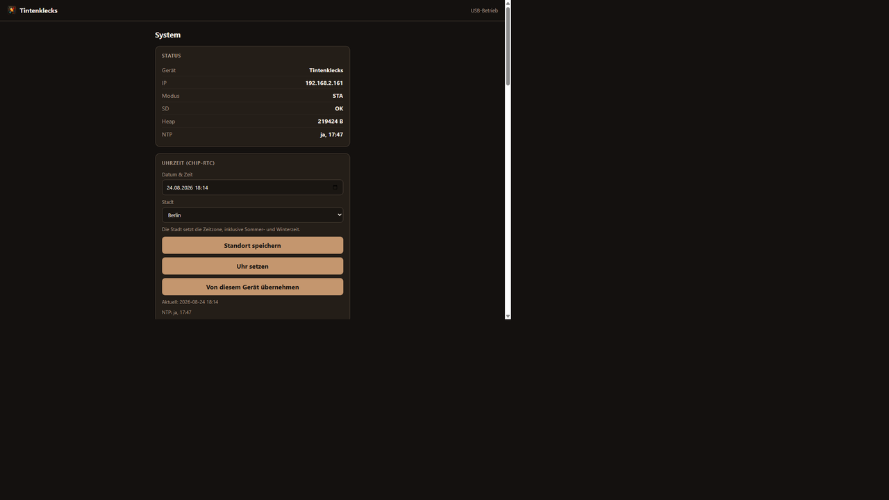

**Status:** Gerät, IP, Modus (AP oder Heimnetz), SD, Heap, NTP.

**Uhrzeit (Chip-RTC):** Stadt im Dropdown, **Standort speichern** (Sommerzeit, danach NTP). Zeit: Feld **Datum & Zeit** und **Uhr setzen**, oder **Von diesem Gerät übernehmen**. Handgestellte Uhr bleibt 10 Minuten stehen, dann holt NTP die Netzzeit — aber nur, wenn ein Zeitserver wirklich geantwortet hat, nicht schon weil die RTC irgendetwas Gültiges hat. Beim Aufwachen ebenfalls NTP. Access Point: keine Netzzeit.

**Akku:** alles, was der AXP2101 hergibt — auch bei USB: Zelle, Prozent, Akkuspannung, USB ja/nein und USB-Spannung, Systemspannung, Pfad (laden/entladen/standby), Ladestufe, Ladestrom- und Ende-Strom-Vorgabe, USB-Limit, PMU-Temperatur, Wärme- und Eingangsbegrenzung, Chip-Warn- und Abschaltschwelle. Kein gemessener Strom, keine mAh. **Ladestrom** 100–1000 mA (Chip-Default 300, Maximum 1000) geht in die Zelle, nicht in den ESP. USB muss Rahmen plus Laden tragen.

**ntfy:** Thema oder volle URL (leer = aus), Priorität Min / Niedrig / Normal / Hoch / Dringend. **Speichern**, **Probe senden**. Alle Benachrichtigungen richten sich nach der eingestellten Priorität. App [ntfy](https://ntfy.sh/).

**Ton:** Lautstärke der Hinweise 0–100, Vorgabe 80. **Lautstärke speichern**.

**Sicherung:** **Sicherung als .txt** holt `pic/` und `sound/` in einer Datei (`tintenklecks-JJJJ-MM-TT.txt`) — geht in Chrome über HTTP. **Sicherung als .zip** dasselbe unkomprimiert; Chrome kann Zip über HTTP sperren, dann Firefox/Edge oder die `.txt`. USB stecken. **Wiederherstellen:** `.txt` und unkomprimiertes `.zip` in einem Rutsch. Komprimiertes Zip noch Datei für Datei. Gleicher Name überschreibt, sonst bleibt alles. Firmware-Backup ist das GitHub-Release.

**Wartung:** **Neustart** (spielt `neustart.wav`). **WLAN-Daten löschen & Neustart** vergisst das Heimnetz (Nachfrage), danach wieder Access Point.

### WLAN-Setup

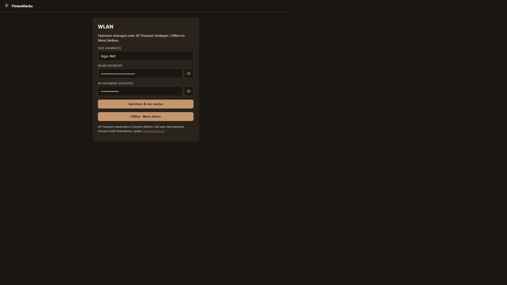

**SSID (Heimnetz)**, **WLAN-Passwort**, **AP-Passwort (Hotspot)** — Auge zeigt oder verdeckt das Passwort. AP-Passwort mindestens 8 Zeichen (WPA2), Vorgabe `tintenklecks`. Gilt nach dem Neustart. Hotspot heißt **Tintenklecks**.

**Speichern & neu starten**. **Offline · Menü öffnen** bleibt ohne Speichern im Menü.

## Lizenz

**Firmware & UI:** siehe [`LICENSE`](LICENSE) — **nicht-kommerziell**. Herkunft Dritter: [CREDITS.txt](CREDITS.txt).

| Erlaubt | Nicht erlaubt |
|---------|----------------|
| Herunterladen; exakte unveränderte Kopien | **Kommerzielle Nutzung** (Verkauf, bezahlter Dienst, Produkt) |
| Privat flashen und nutzen (eigener Rahmen) | Kommerzielles Produkt auf Basis dieses Codes |
| | Veränderte Versionen verbreiten; neu lizenzieren; Hinweise entfernen |

Ziel: Andere dürfen anschauen, kopieren und privat nutzen — aber **nicht kommerzialisieren**.

Demo-Bilder nur dort anders: [`examples/mona_lisa.bmp`](examples/mona_lisa.bmp) (gemeinfrei, Wikimedia) und [`examples/peter.bmp`](examples/peter.bmp) (Beispiel vom Rechteinhaber). Siehe die `SOURCE.md` neben den Dateien.

### Inhaltsregeln (fürs Repo)

- Keine fremden privaten oder modern urheberrechtlich geschützten Fotos committen.
- Keine weiteren Galerie-BMP von der SD ins Git legen, außer den gekennzeichneten Demos.
